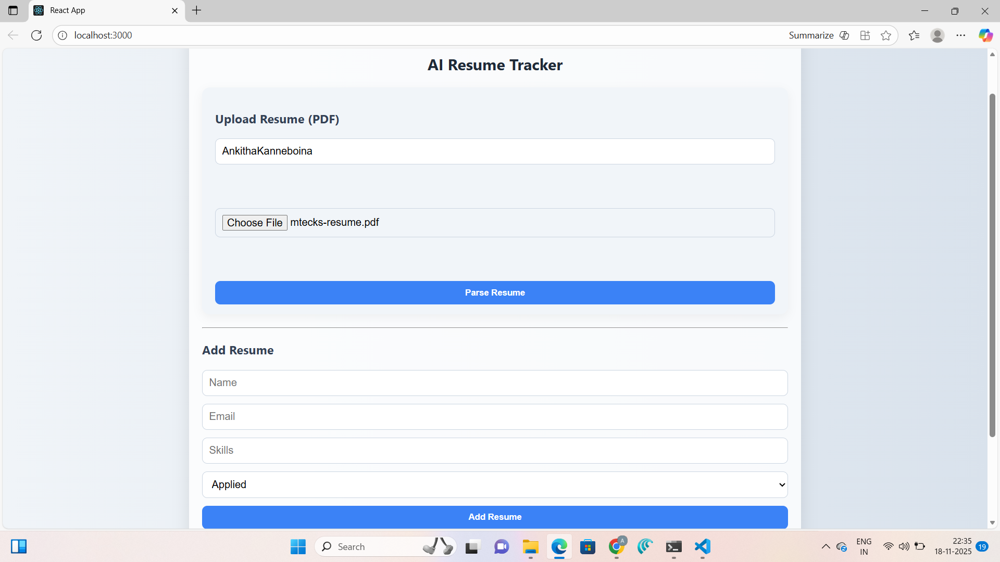
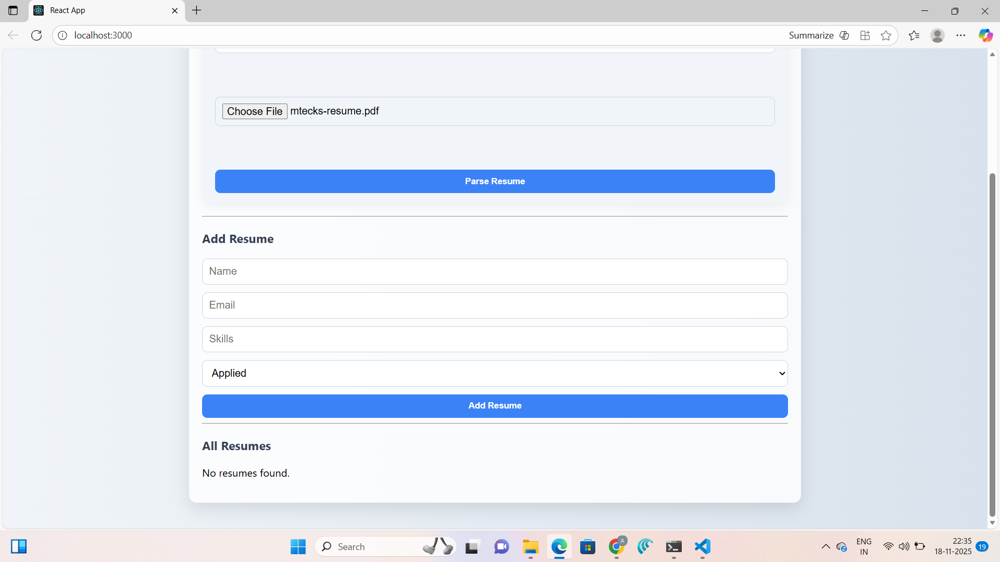
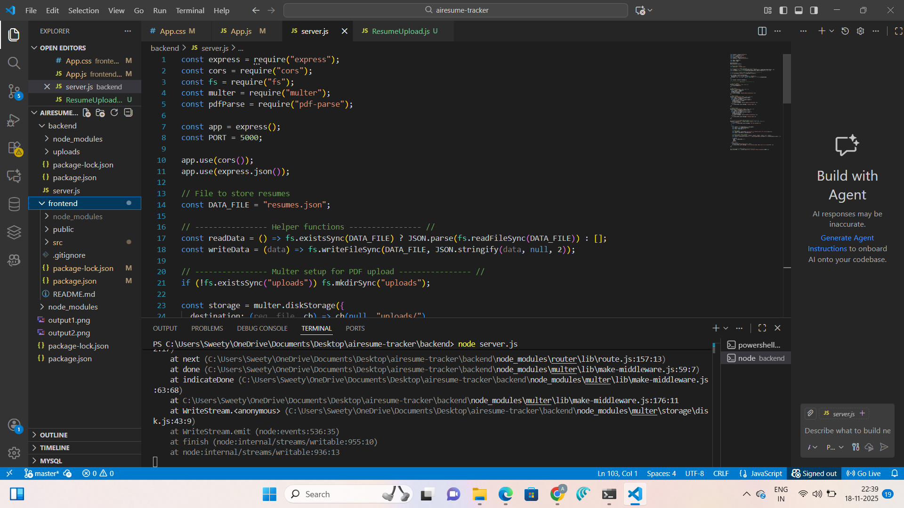

# AI Resume Tracker App


An AI-powered Resume Tracker App that allows users to **upload, parse, and track resumes**, making the recruitment process faster and more efficient. Built with a modern tech stack including **React, Node.js, Express, and MongoDB**.  

---

## 🔗 Demo
[Live Demo Link](http://localhost:3000/)

---

## 📸 Screenshots

### 1. Home / Upload Page


### 2. Resume List / Tracker


### 3. Resume Details / AI Analysis


---

## ✨ Features

- Upload and store resumes in PDF or DOCX format
- AI-based resume parsing and analysis
- View all uploaded resumes in a clean list
- Download or delete resumes
- Search and filter resumes by name, skills, or other metadata
- Responsive design for desktop and mobile

---

## 🛠 Tech Stack

**Frontend:** React, Tailwind CSS  
**Backend:** Node.js, Express  
**Database:** MongoDB  
**Authentication:** JWT (JSON Web Tokens)  
**File Storage:** Local storage / Cloud storage (optional)  

---

## 🚀 Installation

1. Clone the repository:
```bash
git clone https://github.com/ankithakanneboina/ai-resume-tracker.git

ai-resume-tracker/
├─ backend/
│  ├─ routes/
│  ├─ models/
│  ├─ uploads/
│  └─ server.js
├─ frontend/
│  ├─ src/
│  │  ├─ components/
│  │  ├─ pages/
│  │  └─ App.js
├─ .gitignore
├─ README.md
└─ package.json
'''


📫 Contact

Your Name – ankithakanneboina350@example.com

LinkedIn:https://www.linkedin.com/in/ankitha-kanneboina-45a545324/

GitHub: github.com/ankithakanneboina

⚡ License

This project is licensed under the MIT License - see the LICENSE
 file for details.


